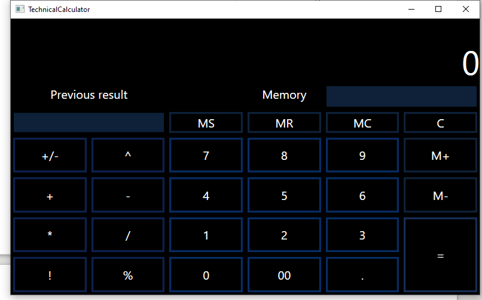

# TechnicalCalculator

Technical calculator for calculating complex expressions (Created in <strong>WPF</strong>).

the reverse Polish notation algorithm is used for calculating complex expressions.

<h2>App features</h2>
<ul>
  <strong><li>the app allows you to calculate integers and floating point numbers</li>
  <li>adding numbers</li>
  <li>subtraction of numbers</li>
  <li>multiplication of numbers</li>
  <li>division of numbers</li>
  <li>division of numbers with remainder</li>
  <li>raising a number to a power</li>
  <li>factorial calculation</li>
  <li>clearing an expression</li>
  <li>The last result is saved</li>
  <li>Working with a number in memory (Saving, Adding a number to the screen, Deleting, Adding a number from memory with a result,subtracting a number from memory with a result)</li></strong>
</ul>

The application architecture is based on the MVVM pattern:

  <ul>
    <li><h3>Model :file_folder:</h3>
    
Number.cs - contains the number model

    
Calculator.cs - contains a model of calculator elements

    
<h4>Operations :open_file_folder:</h4>

    
BinaryOperations.cs - contains methods for calculating binary operations

    
UnaryOperations.cs - contains methods for calculating unary operations

    </li>
    <li><h3>ViewModel :file_folder:</h3>
    
CalculatorViewModel.cs - contains the logic and commands of the calculator

    
ReversePolishNotation.cs - reverse Polish notation algorithm
    
RelayCommand.cs - implements the ICommand interface
</li>
    <li><h3>TechnicalCalculator.UI (View) :file_folder:</h3>
    
MainWindow.xaml - window interface of the application
</li>
  </ul>
  <h3>TechnicalCalculatorTests - Unit Test :file_folder:</h3>
  
OperationsTest.cs - tests methods for performing operations

  
TechnicalCalculatorTests.cs - tests the reverse Polish notation algorithm

